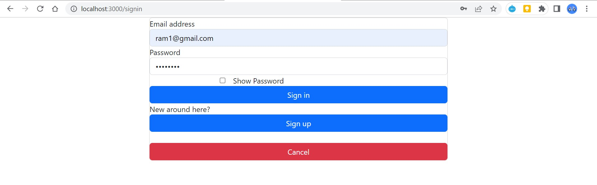
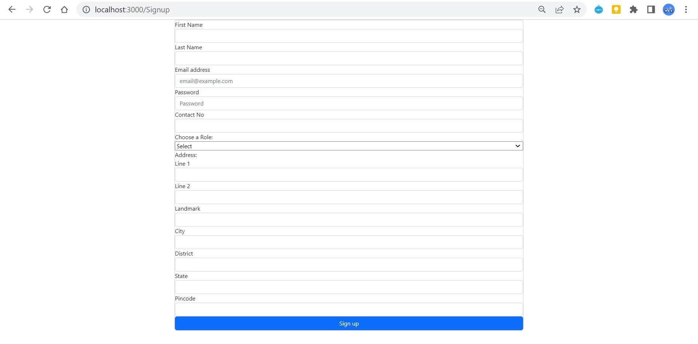
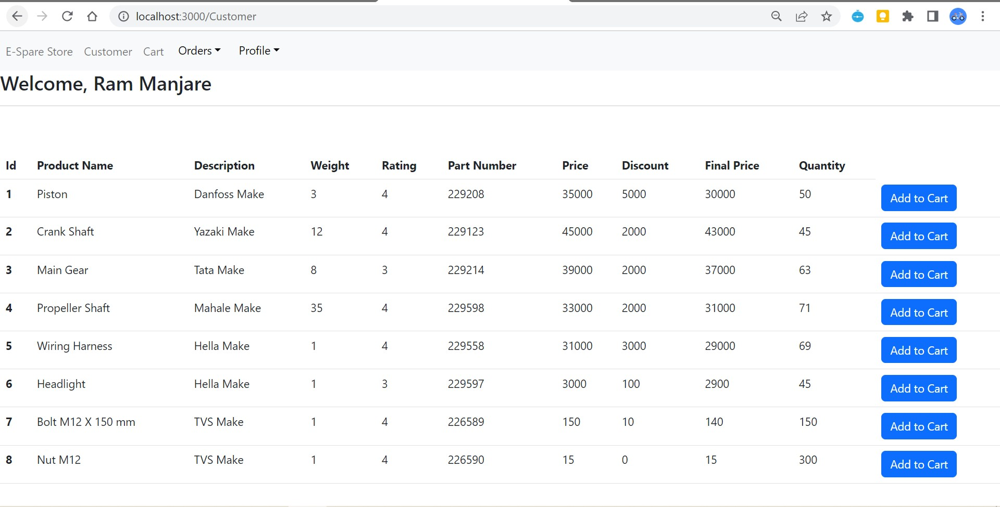
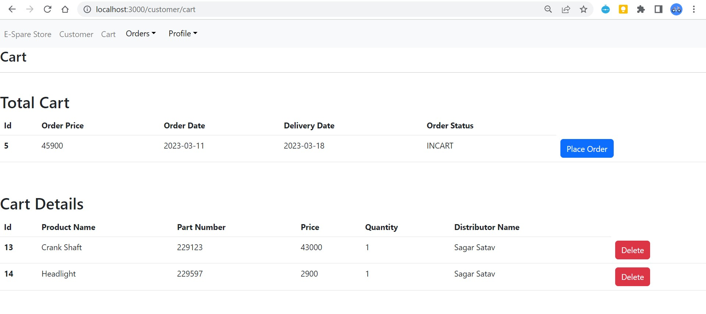
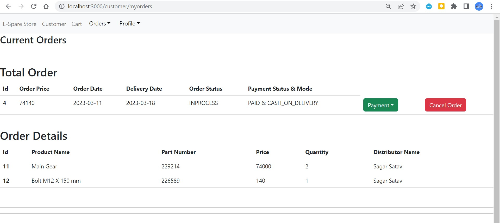
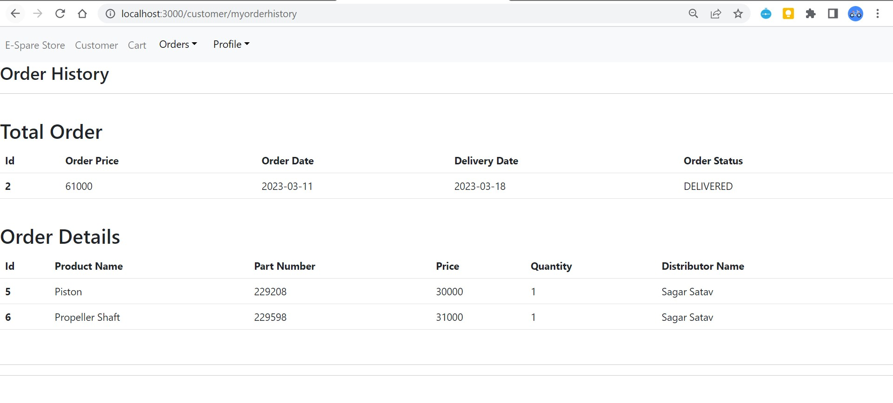
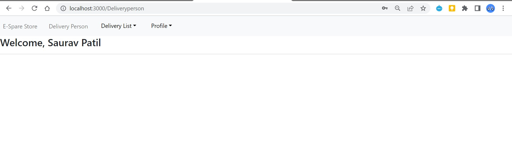
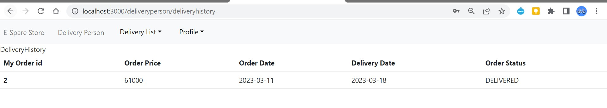
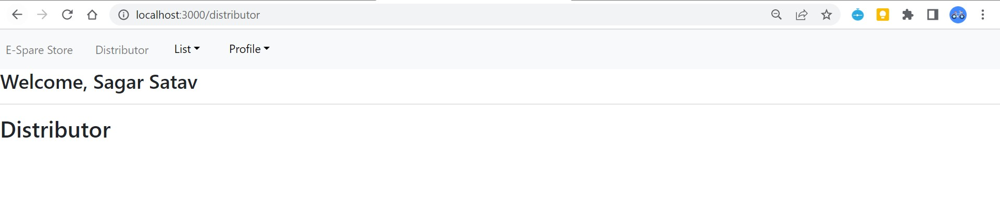

# Online E-Spare Store
This is a modern web-based platform designed to buy spare part by small retailers directly from wholesaler distributor. In earlier days shopkeeper get the products from the chain of 2 to 3 dealers due to which retailers get very less margin on that product. This platform establishes direct relationship between official distributor and retailer. 
Additionally, all the business operations like placing orders, payment on customer side, managing products,
stock on distributor side, managing delivery updates on delivery-person side now can be done very easily in few clicks. Administrator now can easily monitor entire chain of business operations online
and if necessary, improve on it.

## Screenshots
- Home Page   

- Sign In

- Sign Up

- Customer Homepage

- Customer Cart

- Customer Current Orders

- Customer Order History

- Sign Out

- Delivery Person Homepage

- Order Scheduled for Delivery

- Delivered Order History

- Distributor Homepage

- Admin Homepage

- Customer list display

## Future Scope
- Association with Google maps
- Discount /offer management
- email service integration
- payment gateway integration

## Support
For support, email abhisheksaswade125@gmail.com
